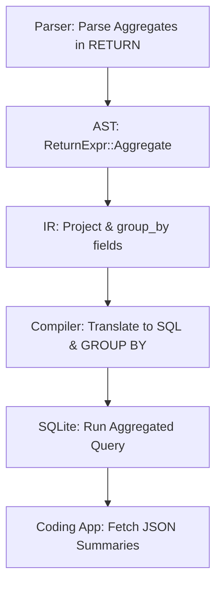

# PQL Aggregation Operations Design & Implementation Plan

This document outlines the plan to design, implement, and integrate aggregation operations (`COUNT`, `SUM`, `AVG`, `MIN`, `MAX`, and `GROUP BY`) into the Panorama Query Language (PQL). This will allow database-side aggregation of heartbeats and stats, fixing the scaling bottleneck highlighted in [WAKAPI_PROGRESS.md](file:///home/michael/Projects/panorama2/WAKAPI_PROGRESS.md).

---

## 1. Problem Statement & Objectives

Currently, `panorama-app-coding` implements a rich stats engine, but queries are executed by:
1. Fetching **all** heartbeats for a given space from the database into memory via:
   `MATCH (n) IN space("default") WHERE HAS_FIELD(n, "coding", "entity") RETURN n`
2. Parsing the rows into Rust `Node` objects.
3. Performing manual filtering, duration summation, grouping, and average daily calculation in the WebAssembly plugin runtime.

### The Bottleneck
As the database grows to thousands or millions of heartbeats, loading and parsing all nodes in WebAssembly will cause severe latency, high CPU usage, and memory exhaustion.

### The Solution
We will extend PQL with support for Cypher-compatible aggregation functions (`COUNT`, `SUM`, `AVG`, `MIN`, `MAX`) and implicit grouping (`GROUP BY`). This allows the storage engine (SQLite) to perform filtering and aggregation directly on indexes and promoted columns, returning only the final aggregated summary rows to the plugin.

---

## 2. PQL Grammar & Syntax Extension (Cypher Flavor)

Cypher uses **implicit grouping**: any column in the `RETURN` clause that is not an aggregate function is automatically treated as a grouping key. We will adopt this standard for PQL.

### Example Queries

#### 1. Group by project and sum duration (Leaderboard / Sum)
```cypher
MATCH (n) IN space("default")
WHERE n CONFORMS TO schema("coding")
  AND n.system.node_time >= 1700000000
RETURN n.coding.project AS project, SUM(n.coding.duration) AS total_duration
```
*Implicit grouping key:* `project`
*Aggregate expression:* `SUM(n.coding.duration)`

#### 2. Get global total count and average duration (Global stats)
```cypher
MATCH (n) IN space("default")
WHERE n CONFORMS TO schema("coding")
RETURN COUNT(n) AS total_count, AVG(n.coding.duration) AS avg_duration
```
*Implicit grouping key:* None (returns a single aggregated row).

### Surface Syntax Grammar Updates

We will extend the `RETURN` clause grammar in `crates/panorama-core/src/query/parser.rs` as follows:

```text
return_clause  = "RETURN" return_col ("," return_col)*
return_col     = aggregate_expr ("AS" ident)? 
               | field_path ("AS" ident)? 
               | var ("AS" ident)?

aggregate_expr = aggregate_func "(" (var | field_path) ")"
aggregate_func = "COUNT" | "SUM" | "AVG" | "MIN" | "MAX"
```

---

## 3. Architecture & Code Changes

To implement this design, changes are required across three layers: **Core AST/Parser/IR**, **Server Compiler**, and the **Coding App Stats Engine**.



### Layer 1: Core AST, Parser, and IR (`crates/panorama-core`)

#### A. AST Definition (`crates/panorama-core/src/query/ast.rs`)
Extend `ReturnExpr` to support aggregate functions:

```rust
#[derive(Debug, Clone, Serialize, Deserialize, PartialEq)]
pub enum AggregateFunc {
  Count,
  Sum,
  Avg,
  Min,
  Max,
}

#[derive(Debug, Clone, Serialize, Deserialize)]
pub enum ReturnExpr {
  /// Whole node: `RETURN n`
  Node(String),
  /// Field projection: `RETURN n.field` or `n.ns.field`
  Field(FieldPath),
  /// Aggregate function: `RETURN COUNT(n)` or `SUM(n.field)`
  Aggregate {
    func: AggregateFunc,
    expr: Box<ReturnExpr>,
  },
}
```

#### B. Parser Implementation (`crates/panorama-core/src/query/parser.rs`)
Implement nom combinators to parse aggregate expressions:

```rust
fn aggregate_func(input: &str) -> IResult<&str, AggregateFunc> {
  alt((
    map(tag_no_case("COUNT"), |_| AggregateFunc::Count),
    map(tag_no_case("SUM"), |_| AggregateFunc::Sum),
    map(tag_no_case("AVG"), |_| AggregateFunc::Avg),
    map(tag_no_case("MIN"), |_| AggregateFunc::Min),
    map(tag_no_case("MAX"), |_| AggregateFunc::Max),
  ))(input)
}

fn aggregate_expr(input: &str) -> IResult<&str, ReturnExpr> {
  let (input, func) = aggregate_func(input)?;
  let (input, _) = preceded(multispace0, tag("("))(input)?;
  let (input, inner) = alt((
    map(field_path, ReturnExpr::Field),
    map(variable, ReturnExpr::Node),
  ))(input)?;
  let (input, _) = preceded(multispace0, tag(")"))(input)?;
  Ok((input, ReturnExpr::Aggregate { func, expr: Box::new(inner) }))
}
```

#### C. Query IR (`crates/panorama-core/src/query/ir.rs`)
Modify the `Project` stage in the query IR to track column expressions (field vs aggregate) and grouping columns:

```rust
#[derive(Debug, Clone, Serialize, Deserialize)]
pub enum ProjectExpr {
  Field(String), // "namespace:field"
  Node(String),  // "variable"
  Aggregate(AggregateFunc, Box<ProjectExpr>),
}

#[derive(Debug, Clone, Serialize, Deserialize)]
pub struct ProjectColumn {
  pub expr: ProjectExpr,
  pub alias: String,
}

#[derive(Debug, Clone, Serialize, Deserialize)]
pub struct Project {
  pub whole_node: bool,
  pub columns: Vec<ProjectColumn>,
  /// Grouping keys inferred from non-aggregated columns when aggregates exist.
  pub group_by: Vec<ProjectExpr>,
}
```

In `lower_to_ir`, we will analyze the AST's `ReturnClause`. If any column is a `ReturnExpr::Aggregate`, then:
- All columns that are **not** `ReturnExpr::Aggregate` are classified as grouping keys.
- These grouping keys are added to `Project::group_by`.

---

### Layer 2: SQL Compiler (`crates/panorama-server`)

The compiler (`crates/panorama-server/src/query/compiler.rs`) must map the IR projection and grouping rules to valid SQLite statements.

#### A. Compiling Aggregate Expressions
When generating SELECT columns, compile each `ProjectExpr`:
- `ProjectExpr::Aggregate(AggregateFunc::Count, inner)` $\to$ `COUNT(*)` (if matching node) or `COUNT(expr)`.
- `ProjectExpr::Aggregate(AggregateFunc::Sum, inner)` $\to$ `SUM(expr)`.
- The `expr` part uses `compile_field_access` to resolve promoted columns (e.g., `sd.duration`) or unpromoted JSON fields (e.g., `json_extract(sd.fields_json, '$.\"coding:duration\".value')`).

#### B. Generating the GROUP BY Clause
If `Project::group_by` is not empty, compile each grouping expression to its SQL equivalent and append them to the SQL statement:

```rust
if !plan.project.group_by.is_empty() {
  let group_parts: Vec<String> = plan.project.group_by
    .iter()
    .map(|expr| compile_project_expr(expr, &ctx, &effective_from))
    .collect::<Result<_, _>>()?;
  sql.push_str(&format!("\nGROUP BY {}", group_parts.join(", ")));
}
```

---

### Layer 3: Coding App Stats Engine Integration (`crates/panorama-app-coding`)

With aggregation done on the database side, we can refactor `crates/panorama-app-coding/src/lib.rs` to query only what is needed.

#### Proposed Refactoring for `execute_stats`

Instead of calling `self.fetch_heartbeats_in_range` (which pulls all rows), the code will construct a single, aggregated PQL query based on the `StatsQuery` parameters.

```rust
async fn execute_stats(
  &self,
  ctx: &dyn PluginContext,
  query: &StatsQuery,
) -> Result<serde_json::Value, PluginError> {
  let group_by = query.group_by.as_deref().unwrap_or("project");
  let (start_epoch, end_epoch) = parse_time_range(&query.range);
  
  // Format filter predicate if present
  let filter_clause = match &query.filter {
    Some(f) if f.contains('=') => {
      let (k, v) = f.split_once('=').unwrap();
      format!("AND n.coding.{} = '{}'", k, v)
    }
    _ => "".to_string(),
  };

  let pql = match query.aggregation.as_str() {
    "count" => format!(
      "MATCH (n) IN space(\"default\") \
       WHERE HAS_FIELD(n, \"coding\", \"entity\") \
         AND n.system.node_time >= {} AND n.system.node_time <= {} {} \
       RETURN n.coding.{} AS key, COUNT(n) AS count",
      start_epoch, end_epoch, filter_clause, group_by
    ),
    "sum" | "leaderboard" => format!(
      "MATCH (n) IN space(\"default\") \
       WHERE HAS_FIELD(n, \"coding\", \"entity\") \
         AND n.system.node_time >= {} AND n.system.node_time <= {} {} \
       RETURN n.coding.{} AS key, SUM(n.coding.duration) AS total_seconds",
      start_epoch, end_epoch, filter_clause, group_by
    ),
    // Additional aggregations like average daily or timeseries can be mapped similarly
    _ => return Err(PluginError::bad_request("Unsupported aggregation")),
  };

  let rows = ctx.query(&pql).await?;
  
  // Post-process the small aggregated result set (e.g., sort, limit, convert to hours)
  Ok(post_process_stats(rows, query))
}
```

---

## 4. Test & Verification Plan

Since database aggregation is critical to system performance, we will implement testing at multiple levels of the pyramid:

```
          ╱ E2E ╲         Integrate with panorama-server, check stats response
         ╱  API  ╲        Test specific aggregate queries via POST /api/query
        ╱  Stats  ╲       Test compiler SQL generation and grouping logic
       ╱   Unit    ╲      Test nom parsing of COUNT, SUM, and ReturnExpr ASTs
```

### 1. Parser Unit Tests (`parser.rs`)
Verify that new aggregation expressions are correctly parsed and rejected when invalid:
- `RETURN COUNT(n)` $\to$ `ReturnExpr::Aggregate { func: Count, expr: Node("n") }`
- `RETURN SUM(n.coding.duration) AS total` $\to$ Parsed with alias.
- `RETURN SUM(n)` $\to$ Should be valid AST (type validation deferred to compilation).
- `RETURN INVALID_FUNC(n.coding.duration)` $\to$ Parser error.

### 2. SQL Compiler Tests (`compiler.rs`)
Validate the compiled SQL structure for correctness:
- Assert that the output SQL contains `GROUP BY json_extract(c.fields_json, ...)` when mixing fields and aggregates.
- Verify that `COUNT(n)` is compiled to `COUNT(*)` or `COUNT(n.id)`.
- Verify that nested namespace qualifiers are correctly compiled.

### 3. Execution & Integration Tests (`sqlite.rs` / `reactor_tests.rs`)
Write integration tests using the local SQLite store:
- Insert 10 heartbeats across 3 projects with different durations.
- Run an aggregated PQL query and assert that the returned JSON contains the exact grouped counts and sums.
- Verify boundary behavior (e.g., zero heartbeats matching range returns empty array, not a database crash).

---

## 5. Timeline & Iteration Stages

| Stage | Focus Area | Deliverables | Status |
|:---:|---|---|:---:|
| **Stage 1** | AST, Parser & IR | Extended AST structs, `nom` parser rules, parser unit tests | 📋 Planned |
| **Stage 2** | SQL Compiler | SQLite generation for aggregate functions & `GROUP BY` | 📋 Planned |
| **Stage 3** | Integration | Refactor `panorama-app-coding` stats engine to use PQL queries | 📋 Planned |
| **Stage 4** | Verification | Run e2e tests & compare performance with in-memory fallback | 📋 Planned |
