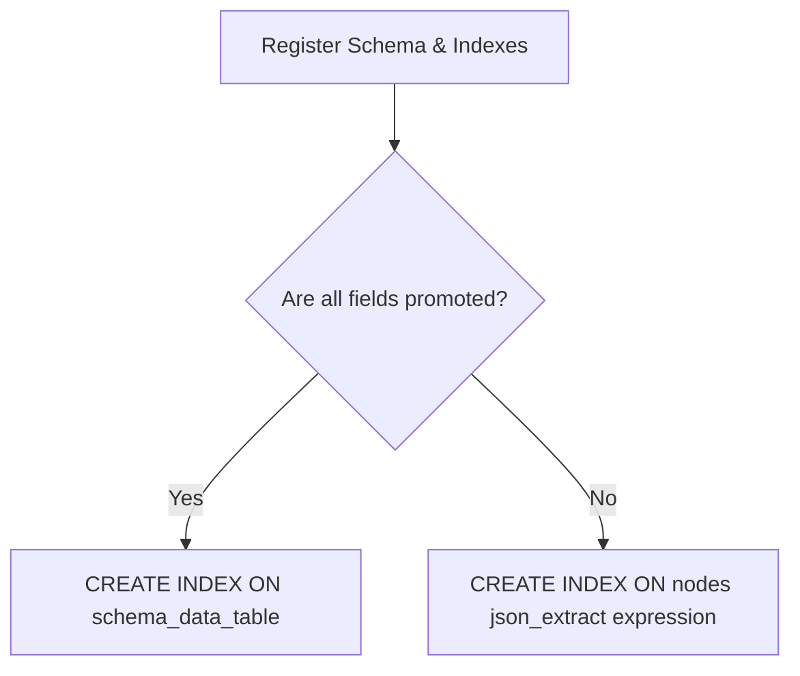

# Schema-Level Indexing Design & Implementation Plan

This document outlines the design and implementation plan for allowing schemas to declare indexes (including composite and unique indexes). This will enable the PQL compiler to verify index availability, optimize query execution, and generate physical SQLite indexes on either promoted columns or JSONB expressions, avoiding expensive full scans and `SCAN` compilation errors.

---

## 1. Objectives & Requirements

- **Declarative Schema Indexes**: Allow schemas to define a list of indexes.
- **Composite & Unique Indices**: Each index can specify one or more fields and whether it enforces a uniqueness constraint.
- **Strict Validation**: Indexes must only reference logical fields defined within the same schema. Any invalid reference should result in a validation error.
- **Physical Index Generation**: Map logical schema indexes to physical SQL indexes:
  - If target fields are **promoted columns**: Generate a table index on the schema-data table.
  - If target fields are **unpromoted JSONB fields**: Generate an expression index on the main `nodes` table's `fields_json` column.
- **Query Compiler Integration**: Update physical schema resolution so the compiler recognizes when a field is covered by an index, avoiding the need for `SCAN(...)` markers in PQL.

---

## 2. Core Data Model Changes (`crates/panorama-core`)

We need to extend the `Schema` struct in `crates/panorama-core/src/schema.rs` to support declaring indexes.

### A. Add `SchemaIndex` Struct
Define the schema index representation:

```rust
/// Represents an index declared on a schema
#[derive(Debug, Clone, Serialize, Deserialize, PartialEq, Eq)]
pub struct SchemaIndex {
  /// Optional name of the index. If not provided, a name is generated.
  pub name: Option<String>,
  /// Logical field names (defined in the same schema) to index.
  /// Ordering dictates index column order.
  pub fields: Vec<String>,
  /// Whether this index enforces a uniqueness constraint.
  pub unique: bool,
}
```

### B. Extend `Schema` struct
Add the `indexes` field to `Schema`. We use `#[serde(default)]` to ensure backwards compatibility when deserializing existing schema definitions:

```rust
pub struct Schema {
  pub node_id: Uuid,
  pub name: String,
  pub version: SchemaVersion,
  pub fields: Vec<SchemaField>,
  pub schema_mode: SchemaMode,
  pub previous_versions: Vec<SchemaVersionRef>,
  pub migrations: Vec<Migration>,
  /// List of indexes declared on this schema
  #[serde(default)]
  pub indexes: Vec<SchemaIndex>,
}
```

---

## 3. Schema Definition Validation

To ensure schema indexes only reference fields provided in the same schema, we will add a new validation method `validate_definition` to `Schema` in `crates/panorama-core/src/schema.rs`.

```rust
impl Schema {
  /// Validate that the schema definition is self-consistent.
  /// Verifies that all fields referenced in indexes exist in the schema.
  pub fn validate_definition(&self) -> Result<(), String> {
    // Collect all valid logical field names declared in this schema
    let defined_fields: std::collections::HashSet<&str> = self
      .fields
      .iter()
      .map(|f| f.name.as_str())
      .collect();

    for index in &self.indexes {
      if index.fields.is_empty() {
        return Err(format!(
          "Schema '{}': Index '{}' must specify at least one field.",
          self.name,
          index.name.as_deref().unwrap_or("<unnamed>")
        ));
      }

      for field in &index.fields {
        if !defined_fields.contains(field.as_str()) {
          return Err(format!(
            "Schema '{}': Index '{}' references field '{}' which is not defined in the schema.",
            self.name,
            index.name.as_deref().unwrap_or(&index.fields.join("_")),
            field
          ));
        }
      }
    }
    Ok(())
  }
}
```

This validation will be called during:
1. Schema registry addition (`SchemaRegistry::register`).
2. Plugin load time (`PluginLoader` validation flow).

---

## 4. Meta Table Management & Physical Storage

### A. Meta Table Update (`managed_indexes`)
The `managed_indexes` meta table currently has a `target_field TEXT` column.
For composite indexes, we will:
- Store the list of fields in `target_field` as a JSON array (e.g., `["first_name", "last_name"]`) or a comma-separated list. Storing as a JSON array is preferred as it is robust and clean.
- Update `ManagedIndex` serialization/deserialization to handle JSON arrays.

```rust
// In crates/panorama-server/src/meta.rs:
pub struct ManagedIndex {
  pub index_id: Uuid,
  pub target_schema_id: Option<Uuid>,
  /// Stores serialized JSON array of logical field names for composite indexes
  pub target_field: String, 
  pub index_type: String,
  pub physical_index_name: String,
  pub status: IndexStatus,
  pub created_at: DateTime<Utc>,
}
```

### B. Physical Index DDL Generation
When registering a schema and setting up physical storage in the database, we need to create the SQL indexes.



#### Scenario 1: Promoted Columns
If all index fields are promoted to columns on the schema data table `schema_data_abc123`, create a standard composite index:
```sql
CREATE [UNIQUE] INDEX IF NOT EXISTS idx_event_start_end 
ON schema_data_abc123 (start_col, end_col);
```

#### Scenario 2: Unpromoted/JSONB Columns
If some or all index fields remain unpromoted (stored in `fields_json`), create an expression-based index on the main `nodes` table:
```sql
CREATE [UNIQUE] INDEX IF NOT EXISTS idx_expr_event_start_end 
ON nodes (
  json_extract(fields_json, '$."app:start_time".value'),
  json_extract(fields_json, '$."app:end_time".value')
);
```

---

## 5. Query Compiler Integration (`crates/panorama-server/src/query`)

### A. Update Physical Schema Resolution
During compilation Phase 1, `resolve_physical_schema` in `crates/panorama-server/src/query/physical.rs` maps fields to `FieldAccess` models.
For composite indexes, we parse the JSON array in `target_field` and mark **all component fields** as `FieldAccess::Indexed`.

```rust
// In crates/panorama-server/src/query/physical.rs:
for idx in &indexes {
  // Parse target fields from JSON array or split comma-separated values
  let target_fields: Vec<String> = serde_json::from_str(&idx.target_field)
    .unwrap_or_else(|_| vec![idx.target_field.clone()]);

  for field in &target_fields {
    if !fields.contains_key(field) {
      let json_path = field.clone(); 
      fields.insert(
        field.clone(),
        FieldAccess::Indexed {
          index_name: idx.physical_index_name.clone(),
          json_path,
        },
      );
    }
  }
}
```

Since the fields are marked as `FieldAccess::Indexed`, the query compiler's `enforce_scan` check will evaluate `requires_scan` to `false`, allowing predicates on those fields without throwing a compile-time scan error or requiring `SCAN(...)`.

---

## 6. Implementation Checklist

### Phase 1: Core Structs & Validation
- [ ] Add `SchemaIndex` struct and `indexes` field to `Schema` in `schema.rs`.
- [ ] Add `validate_definition` method to `Schema` with comprehensive unit tests checking valid/invalid field references.
- [ ] Add index validation to `SchemaRegistry::register` so invalid schemas are rejected.

### Phase 2: Server MetaStore Updates
- [ ] Update `ManagedIndex` and index creation SQL in `meta.rs` to handle JSON array serialization for target fields.
- [ ] Implement SQL generation for indexes in `MetaStore`:
  - Determine if fields are promoted vs unpromoted.
  - Generate the appropriate `CREATE [UNIQUE] INDEX` statement (column-based vs expression-based).
  - Execute index creation on the database connection.

### Phase 3: Physical Schema & Compiler Updates
- [ ] Update `resolve_physical_schema` in `physical.rs` to parse composite index fields and map them to `FieldAccess::Indexed`.
- [ ] Write query compiler tests verifying that querying a field declared in a schema index does **not** require a `SCAN(...)` marker.

### Phase 4: E2E and Regression Tests
- [ ] Add an integration test in `crates/panorama-server/tests` that registers a schema with a unique composite index, inserts conforming nodes, queries them using the index (without `SCAN`), and validates that uniqueness constraints are enforced.
- [ ] Test against the in-memory pure evaluator. It shouldn't need new changes, since indexes are purely a performance improvement and should have no bearing on correctness. Ensure you write proptests using `proptest!` library.
- [ ] Run `just test-e2e` to verify all components pass.
