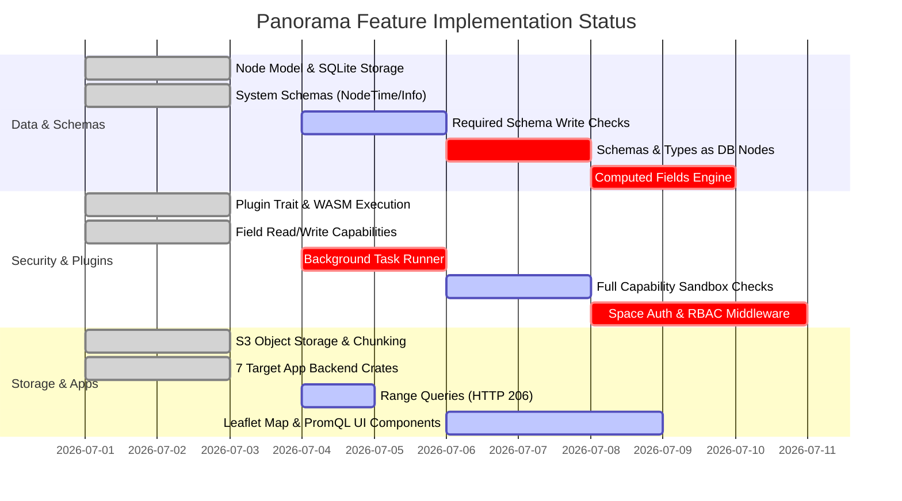

# Panorama Implementation Progress & Gap Analysis

**Date**: July 3, 2026  
**Target Spec**: [DESIGN.md](file:///home/michael/Projects/panorama2/DESIGN.md)  
**Codebase Version**: Panorama v0.1.0  

---

## Executive Summary

The current Panorama codebase provides a solid, working v0.0 foundation. The core platform architecture is built in Rust using Axum and SQLite, supportingnamespaced key-value field nodes, a WASM-based plugin distribution model (`.panoapp` files evaluated via `wasmtime`), S3-like object storage, and a Vite/React frontend.

However, significant architectural features detailed in [`DESIGN.md`](file:///home/michael/Projects/panorama2/DESIGN.md) remain either **partially implemented** or **missing**.

- **Overall Progress Estimate**: **~55% Complete**
- **Core Strengths**: Strong plugin API abstraction, WASM sandboxed execution pathway, SQLite node storage, object storage chunking, and baseline native implementations for 7 target v0.0 apps.
- **Primary Gaps**: Required schema enforcement on write, self-hosted schemas/types as nodes, computed field execution engine, space-level multi-user authorization, full runtime capability enforcement, multi-node transaction support, device synchronization protocols, and full frontend UI components for several target workflows.

---

## Detailed Gap Analysis by Feature Area

### 1. Core Data Model & Node Storage

| Requirement ([DESIGN.md](file:///home/michael/Projects/panorama2/DESIGN.md#L7-L11)) | Status | Implementation Details & Remaining Work |
| :--- | :---: | :--- |
| **Node ID & Metadata** | **COMPLETE** | Implemented via `Node` struct in [`panorama-core/src/types.rs`](file:///home/michael/Projects/panorama2/crates/panorama-core/src/types.rs#L8-L23) with `UUIDv4` primary keys and `HashMap<String, FieldValue>` namespaced fields. |
| **Non-Relational Storage** | **COMPLETE** | Implemented via SQLite in [`panorama-server/src/storage.rs`](file:///home/michael/Projects/panorama2/crates/panorama-server/src/storage.rs#L13-L42) storing nodes with JSON field blobs and WAL mode. |
| **Relational Indexes** | **PARTIAL** | Basic `json_extract` SQL queries exist for field filtering. Missing: Dynamic user/app-defined relational index creation over node fields. |

---

### 2. Schema & Type System

| Requirement ([DESIGN.md](file:///home/michael/Projects/panorama2/DESIGN.md#L12-L35)) | Status | Implementation Details & Remaining Work |
| :--- | :---: | :--- |
| **Schemas as Nodes** | **MISSING** | Schemas and Types are currently Rust structs (`Schema`) stored in memory ([`SchemaRegistry`](file:///home/michael/Projects/panorama2/crates/panorama-server/src/schema_registry.rs#L10-L14)), rather than being first-class `Node` instances stored in the node database with Schema/Type system schemas. |
| **System Schemas** | **COMPLETE** | `NodeTime` (`system:node_time`, `system:node_start_time`, `system:node_end_time`) and `NodeInfo` (`system:node_title`, `system:node_description`) exist in [`schema.rs`](file:///home/michael/Projects/panorama2/crates/panorama-core/src/schema.rs#L225-L319). System timestamps `created_at` / `updated_at` are tracked. |
| **Preferred vs. Required Schemas** | **PARTIAL** | [`Schema::validate`](file:///home/michael/Projects/panorama2/crates/panorama-core/src/schema.rs#L125-L182) logic exists. However, [`NodeStorage::create`](file:///home/michael/Projects/panorama2/crates/panorama-server/src/storage.rs#L73-L94) and [`NodeStorage::update`](file:///home/michael/Projects/panorama2/crates/panorama-server/src/storage.rs#L105-L128) **do not enforce** required schemas on write. Nodes violating required schemas are currently saved without error. Preferred schema warning propagation to API responses / UI is unintegrated. |
| **Schema Versioning & Compatibility** | **COMPLETE** | `SchemaVersion` (`major.minor`) and `is_compatible_with()` implemented in [`types.rs`](file:///home/michael/Projects/panorama2/crates/panorama-core/src/types.rs#L38-L54). |
| **Schema Migrations** | **PARTIAL** | `Migration` struct with `field_mappings` exists in [`schema.rs`](file:///home/michael/Projects/panorama2/crates/panorama-core/src/schema.rs#L91-L99), but there is no migration runner to transform nodes across schema versions. |

---

### 3. Spaces & Multi-User Permissions

| Requirement ([DESIGN.md](file:///home/michael/Projects/panorama2/DESIGN.md#L36-L41)) | Status | Implementation Details & Remaining Work |
| :--- | :---: | :--- |
| **Space Data Model** | **COMPLETE** | `Space` and `SpaceMember` defined in [`spaces.rs`](file:///home/michael/Projects/panorama2/crates/panorama-server/src/spaces.rs#L7-L27). Nodes store `space_id: Uuid`. |
| **Space-Level Permission Enforcement** | **MISSING** | `SpaceManager` is a v0.0 in-memory stub. No authorization middleware exists to restrict API or plugin access based on user identity or space roles (`Owner`, `Admin`, `Member`, `Viewer`). |
| **Space Sharing & Public Nodes** | **MISSING** | No endpoints or UI to manage space members, share spaces, or mark spaces as public. |
| **Cross-Space Node Replication** | **MISSING** | No background replication mechanism for copying/syncing nodes between private and public spaces. |

---

### 4. App Ecosystem & Capability Security Model

| Requirement ([DESIGN.md](file:///home/michael/Projects/panorama2/DESIGN.md#L42-L70)) | Status | Implementation Details & Remaining Work |
| :--- | :---: | :--- |
| **Plugin Architecture** | **COMPLETE** | [`Plugin`](file:///home/michael/Projects/panorama2/crates/panorama-core/src/plugin.rs#L15-L81) trait defined. Support for native plugins and `.panoapp` WASM bundles via [`wasmtime`](file:///home/michael/Projects/panorama2/crates/panorama-server/src/wasm_runtime.rs#L73-L171) sub-process execution. |
| **Background Tasks** | **MISSING** | `BackgroundTask` can be declared by plugins, but `PluginLoader` / `panorama-server` never schedules or executes background tasks. |
| **Capability Enforcement** | **PARTIAL** | `RuntimeContext` in [`plugin_runtime.rs`](file:///home/michael/Projects/panorama2/crates/panorama-server/src/plugin_runtime.rs#L45-L65) checks `field_read` and `field_write` grants. **Missing runtime enforcement** for: `network_hosts`, `file_read`, `file_write`, `execute`, `dns_requests`, `object_storage_read/write`, and `write_own_nodes`. |
| **App-Managed Nodes** | **PARTIAL** | `AppManagedInfo` struct exists on `Node`, but user-modification protection is not enforced at the storage/API layer. |
| **Capability Consent UI** | **MISSING** | Frontend does not prompt users to review or grant capabilities when loading/installing apps. |
| **Per-App Virtual Hosts** | **PARTIAL** | Plugins are routed under subpaths `/plugin/{id}/*` on the primary host rather than dedicated virtual hostnames. |

---

### 5. Fields, Namespaces & Computed Fields

| Requirement ([DESIGN.md](file:///home/michael/Projects/panorama2/DESIGN.md#L71-L88)) | Status | Implementation Details & Remaining Work |
| :--- | :---: | :--- |
| **Field Namespaces** | **PARTIAL** | Namespaces (`system:`, `user:`, `<app>:`) are formatted as string keys. Missing: Mapping raw data storage keys to opaque locally-generated IDs to allow app swapping. |
| **Computed Fields Evaluator** | **PARTIAL** | [`evaluate_simple_expression`](file:///home/michael/Projects/panorama2/crates/panorama-core/src/field.rs#L71-L113) and [`detect_cycles`](file:///home/michael/Projects/panorama2/crates/panorama-core/src/field.rs#L116-L138) exist in `field.rs`. However, they are **not integrated** into the node read/write storage lifecycle. |
| **Compute Modes (Eager, Deferred, Read)** | **MISSING** | Neither Eager (pre-write sync), Deferred (post-write async background worker), nor Read evaluation policies are active. |
| **WASM / JIT User-Defined Functions** | **MISSING** | No execution engine to run user-defined WASM blobs/JIT functions in database context for computed field evaluation. |

---

### 6. Transactions & Atomicity

| Requirement ([DESIGN.md](file:///home/michael/Projects/panorama2/DESIGN.md#L89-L95)) | Status | Implementation Details & Remaining Work |
| :--- | :---: | :--- |
| **Multi-Node Atomic Writes** | **MISSING** | No multi-node transaction endpoint or database transaction wrapper for atomic updates across multiple nodes. |
| **Schema Gate for Transactions** | **MISSING** | No validation checks gating transactions on strict schema compliance. |
| **Offline Transaction Feedback** | **MISSING** | No client-side offline detection or UI error state indicating transaction impossibility. |

---

### 7. Synchronization & Central Server

| Requirement ([DESIGN.md](file:///home/michael/Projects/panorama2/DESIGN.md#L96-L98)) | Status | Implementation Details & Remaining Work |
| :--- | :---: | :--- |
| **Central Server** | **COMPLETE** | Standalone Axum server serving REST endpoints and static UI assets. |
| **Multi-Device Synchronization** | **MISSING** | No sync protocol, change tracking log, delta replication, or offline queueing across devices. |

---

### 8. Object Storage System

| Requirement ([DESIGN.md](file:///home/michael/Projects/panorama2/DESIGN.md#L99-L105)) | Status | Implementation Details & Remaining Work |
| :--- | :---: | :--- |
| **S3-like Blob Storage** | **COMPLETE** | `ObjectStorage` in [`object_store.rs`](file:///home/michael/Projects/panorama2/crates/panorama-server/src/object_store.rs#L34-L125) handles bucket/key file storage and `ObjectRef` linking. |
| **Resumable Chunked Uploads** | **COMPLETE** | Implemented via `/api/uploads`, `/api/uploads/{id}/chunks`, and `/api/uploads/{id}/complete` endpoints. |
| **Range Queries / Partial Content** | **MISSING** | `GET /api/objects/{bucket}/{key}` in [`api.rs`](file:///home/michael/Projects/panorama2/crates/panorama-server/src/api.rs#L195-L208) does not parse `Range` headers or return HTTP 206 for audio/video streaming. |
| **Storage Usage Querying** | **MISSING** | No API endpoint to sort objects by file size or query storage usage per space/bucket. |

---

### 9. Workflows Target Implementation (v0.0 Apps)

| Target Workflow ([DESIGN.md](file:///home/michael/Projects/panorama2/DESIGN.md#L116-L138)) | Status | Backend / App Crate | Frontend / UI Integration |
| :--- | :---: | :--- | :--- |
| **Journal App** | **PARTIAL** | [`panorama-app-journal`](file:///home/michael/Projects/panorama2/crates/panorama-app-journal/src/lib.rs#L15-L214) creates markdown entry nodes. | Basic view present; missing automatic block-level paragraph node breakdown and cross-reference links. |
| **Wakatime Tracker** | **COMPLETE** | [`panorama-app-wakatime`](file:///home/michael/Projects/panorama2/crates/panorama-app-wakatime/src/lib.rs) exposes `/heartbeat` and `/heartbeats` storing `system:node_time`. | Endpoint functional; standard time-series ingestion active. |
| **Grafana Dashboards** | **PARTIAL** | [`panorama-app-grafana`](file:///home/michael/Projects/panorama2/crates/panorama-app-grafana) supports count, sum, and leaderboard queries. | Dashboard UI panel exists; missing full PromQL expression parser & timeframe range selectors ({24h, 7d}). |
| **Trip Planner** | **PARTIAL** | [`panorama-app-trips`](file:///home/michael/Projects/panorama2/crates/panorama-app-trips) creates trips and events with latitude/longitude fields and map endpoints (`/events/map`). | Trip list view exists; missing interactive Leaflet/OpenLayers map rendering view. |
| **Beli (Restaurant Ratings)** | **COMPLETE** | [`panorama-app-beli`](file:///home/michael/Projects/panorama2/crates/panorama-app-beli) implements pairwise comparisons and Kahn's topological sort ranking algorithm into tiers. | UI ranking panel functional; missing external OSM public data fetching. |
| **Subsonic Music Streaming** | **PARTIAL** | [`panorama-app-subsonic`](file:///home/michael/Projects/panorama2/crates/panorama-app-subsonic) handles `/rest/ping`, `/rest/getArtists`, `/upload`, `/rest/stream`. | Basic player registered; missing full Subsonic protocol coverage (token/salt auth, cover art, playlists, audio range streaming). |
| **File Manager** | **COMPLETE** | [`panorama-app-files`](file:///home/michael/Projects/panorama2/crates/panorama-app-files) uploads and downloads files via Object Storage. | File listing functional; missing drag-and-drop resumable upload UI widget. |

---

## Comprehensive Implementation Matrix

---

## Action Plan & Phased Roadmap to 100% Completion

### Phase 1: Core Engine & Schema Hardening
1. **Required Schema Write Enforcement**: Update `NodeStorage::create` and `NodeStorage::update` in [`storage.rs`](file:///home/michael/Projects/panorama2/crates/panorama-server/src/storage.rs) to call `Schema::validate()` when required schemas are present, returning an error on invalid writes.
2. **Self-Hosted Schemas as Nodes**: Store schemas and types as standard `Node` entries in the node storage, adhering to `Schema` and `Type` meta-schemas.
3. **Computed Fields Execution Engine**: Wire `evaluate_simple_expression` into node create/update pipeline for `Eager` mode and create an async background worker queue for `Deferred` mode.

### Phase 2: Security & Capabilities Sandbox
1. **Background Task Scheduler**: Implement a tokio-based background worker in `PluginLoader` to execute `BackgroundTask` routines registered by plugins.
2. **Runtime Capability Checks**: Add guards in `PluginContext` for `network_hosts`, `file_read/write`, `execute`, `dns_requests`, and `write_own_nodes`.
3. **Space RBAC Middleware**: Implement authentication and space-level permission checks for all `/api/*` endpoints.

### Phase 3: Advanced Storage, Transactions & Sync
1. **HTTP Range Queries**: Support `Range` headers in `get_object` endpoint for byte-range streaming.
2. **Atomic Multi-Node Transactions**: Add a transaction endpoint `POST /api/transactions` providing atomic multi-node writes.
3. **Export/Import Utilities**: Create `/api/export` and `/api/import` endpoints producing/consuming standard JSON/ZIP archives.

### Phase 4: UI & Application Workflow Refinement
1. **Trip Planner Map View**: Integrate an interactive Leaflet/OpenLayers map component in `frontend/src/plugins`.
2. **Journal Block Parser**: Add client-side markdown parsing to automatically slice notes into paragraph nodes linked via `paragraph_refs`.
3. **Dashboard PromQL Parser**: Implement a lightweight PromQL expression parser for time-series aggregation in `panorama-app-grafana`.
